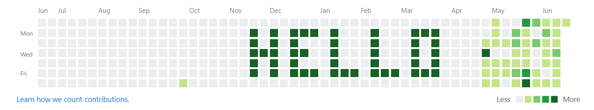

# GitHub Contributions Message

Artificially generate Git commits in the past to write a message in your GitHub contributions bar.  

## Usage

`main.js` takes 2 arguments.  
- `baseline`: the number of commits on each day.  
- `message` : the message to create.  

Example: `node main.js 20 "Hello World"`
